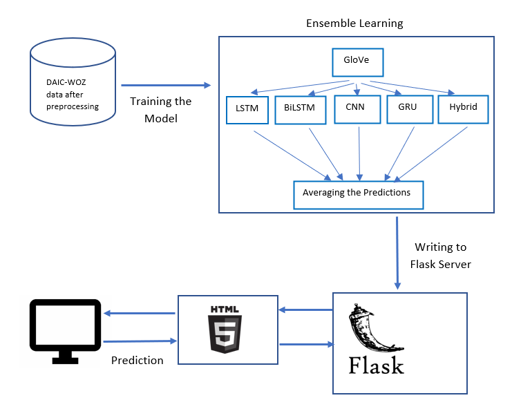

# Detecting Depression with a Flask Application

The mental health of young adults and teenagers proves to be vitalfor having a flourishing life. Neglecting the issue of
mental health can lead toanxiety, stress, and depression. These problems need to be addressed in theearly stages to
ensure better mental health for young adults. This paper pro-vides a comprehensive study by leveraging natural language
processing anddeep learning techniques to detect depression by examining the relationshipbetween language usage and the
psychological characteristics of the commu-nicator. A private dataset DAIC-WOZ has been used to predict the levelsof
depression. It includes audio, video, and textual information from 189 in-terviews. This paper focuses on the textual
analysis of detecting depressionfrom transcripts of the interviews conducted by an animated virtual inter-viewer. Due to
the disadvantages faced by the context independent nature ofGloVe embeddings, the proposed approach uses transfer
learning techniquessuch as ELMo, ULMFit, and BERT for predicting depression severity fromtranscripts. Furthermore, a
Python Web application has been deployed toidentify negative sentiments and depression severity from sentences
inputtedfrom the user. The proposed approach uses an ensemble learning methodfor the application to provide better
predictions for classifying the texts intolevels of depression. Hence, the inferences made in this paper can be
extrap-olated to other all demographics around the world to help detect depressionin textual data as the algorithms and
techniques used are all-encompassing.

Check
this [article](https://srijha09.github.io/Home/healthcare/mentalhealth/nlp/bert/transformers/wordembeddings/transferlearning/flask/2020/06/20/depression.html)
for more detailed explanations

## Model Achitecture

Flask is a web framework for the programming language python, whichmeans it offers features to create web applications,
including handling HTTPrequests and creating templates. The Python Flask framework has beendeployed to identify emotions
and recognize the level of depression from auser input sentence. According to Figure 11, the pre-processed
tokenizedwords are converted to word embeddings using the pretrained GloVe wordembeddings. The word embeddings are
trained with each model to producepredictions which is then followed by ensemble averaging method to producebetter
predictions. The ensemble predictions are then written into the Flaskserver and the predictions are outputted based on
the user’s input.



## check python version should be 3.9 or above

```bash
python --version
```

## install dependencies

```bash
pip install -r requirements.txt
```

## Run the application using the following command

```bash
python app.py
```

open the link in the browser http://127.0.0.0:5000/


