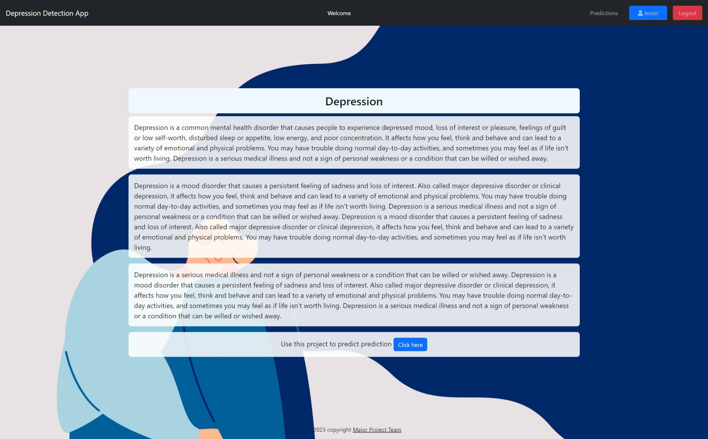
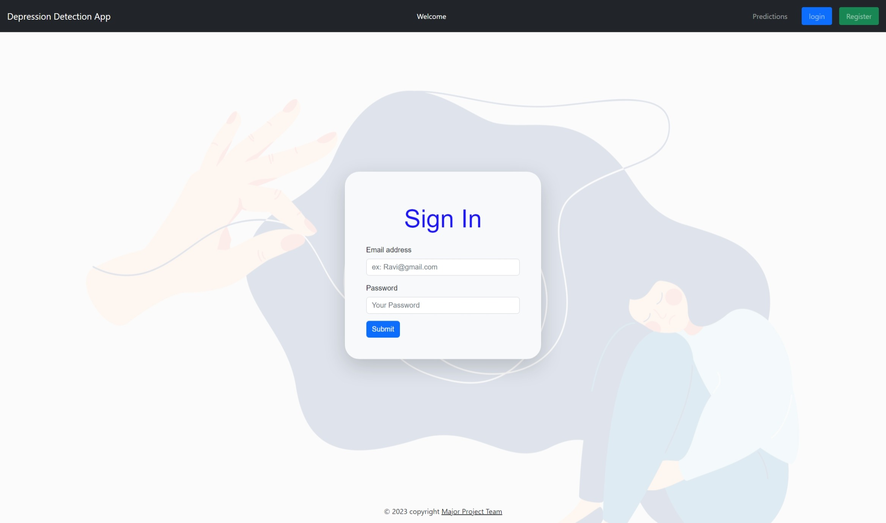
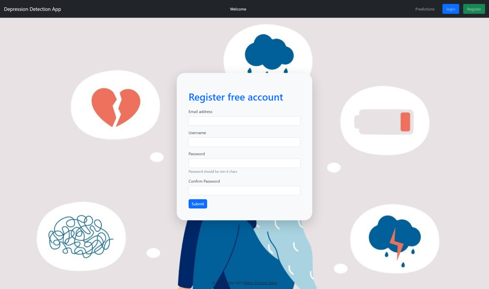

# Detecting Depression 

The mental health of young adults and teenagers proves to be vitalfor having a flourishing life. Neglecting the issue of
mental health can lead toanxiety, stress, and depression. These problems need to be addressed in theearly stages to
ensure better mental health for young adults. 
Check
this [article](https://srijha09.github.io/Home/healthcare/mentalhealth/nlp/bert/transformers/wordembeddings/transferlearning/flask/2020/06/20/depression.html)
for more detailed explanations


## check python version should be 3.9 or above

```bash
python --version
```

## install dependencies

```bash
pip install -r requirements.txt
```

## Run the application using the following command

```bash
python app.py
```

open the link in the browser http://127.0.0.0:5000/


## screenshots





